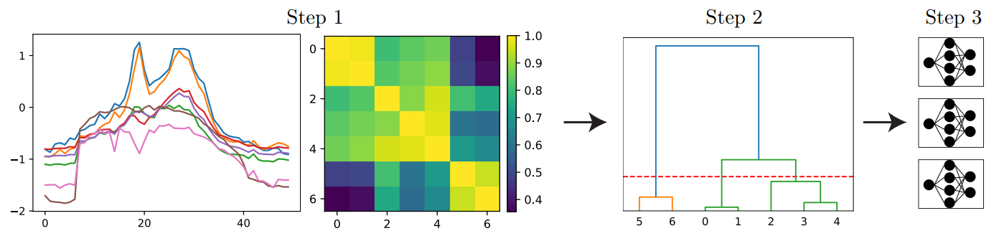

# A Multi-Task Learning Approach to Linear Multivariate Forecasting (AISTATS 2025 poster)


Official implementation of:
"[A Multi-Task Learning Approach to Linear Multivariate Forecasting](https://arxiv.org/abs/2502.03571)". 

## TLDR

This project proposes a multi-task learning (MTL) approach to linear multivariate time series forecasting (TSF). The method involves analyzing gradient conflicts and variate correlations to motivate variate grouping and gradient scaling. Variates are clustered based on their correlations, and separate weights are assigned to each cluster to reduce computational demands. A gradient magnitude penalty is introduced to balance the optimization process within each group. The resulting framework, MTLinear, effectively addresses MTL challenges and demonstrates superior performance on various datasets compared to existing baselines.



## Details

MTLinear - a general model for multivate forecasting, using multi-task learning techniques. This is the vanilla linear multi-model.

MTDLinear - implementation based on the DLinear model.

MTNLinear - implementation based on the NLinear model.

MTRLinear - implementation based on the RLinear model.

run scripts are given in the scripts folder, the files are designed for grid search but feel free to change the parameter to the ones from the original paper.
The original params are given in the "grid_search" folder. All parameters were selected based on the validation set with accordance with the standard Informer (LTSF) protocol.


### Environment Requirements
```
conda create -n MTLinear python=3.9
conda activate MTLinear
pip install -r requirements.txt
```
Make sure to install also a suitable pytorch. Original implementation used the following version: 2.1.1+cu118

### Data Preparation

You can obtain all the nine benchmarks from [Google Drive](https://drive.google.com/drive/folders/1ZOYpTUa82_jCcxIdTmyr0LXQfvaM9vIy) provided in Autoformer. All the datasets are well pre-processed and can be used easily.

```
mkdir dataset
```
**Please put them in the `./dataset` directory**

## Citing

If you find this repository useful for your work, please consider citing it as follows:

```BibTeX
@article{nochumsohn2025multi,
  title={A Multi-Task Learning Approach to Linear Multivariate Forecasting},
  author={Nochumsohn, Liran and Zisling, Hedi and Azencot, Omri},
  journal={arXiv preprint arXiv:2502.03571},
  year={2025}
}
```


## Acknowledgement


This code is simply built on the code base of Autoformer. We appreciate the following GitHub repos a lot for their valuable code base or datasets:

The implementation of Autoformer, Informer, and Transformer is from https://github.com/thuml/Autoformer

The implementation of DLinear, NLinear is from https://github.com/cure-lab/LTSF-Linear

Please remember to cite all the datasets and compared methods if you use them in your experiments.
